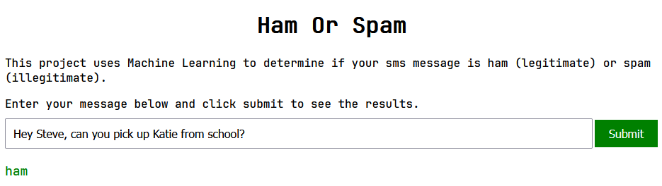
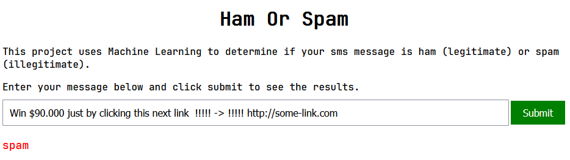

# Ham Or Spam Classifier

## Introduction

TThis project uses Machine Learning to predict if a sms message is ham (real) or spam (fake). The model is using inside a web application. The dataset used is the [SMS Spam Collection Dataset](https://www.kaggle.com/uciml/sms-spam-collection-dataset) from Kaggle.

## Setup

1. Clone the repository

```bash
git clone https://github.com/Detopall/ham-or-spam
```

### Server Setup

1. Install the dependencies

```bash
cd ham-or-spam
cd server
pipenv install
```

2. Run the server

```bash
pipenv shell
python app.py
```

### Client Setup

```bash
cd ham-or-spam
cd client
```

You can now just run the index.html file in your browser or use a live server.

## Usage

Place the message you want to test in the input field and click on the submit button. The result will be displayed below.

## Examples

**HAM**


**SPAM**

